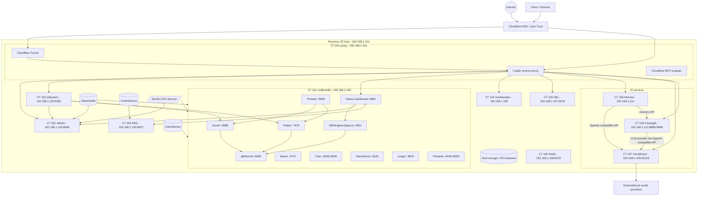
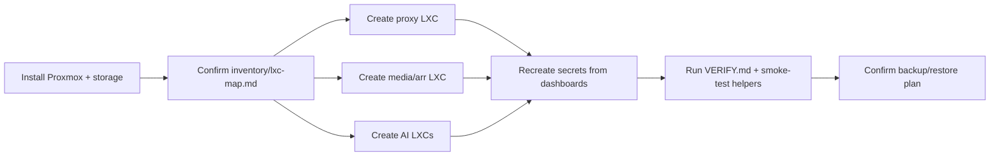

# Homelab Architecture

This diagram is the high-level rebuild map. Use it with:

- [`Fresh-Homelab-Rebuild.md`](./Fresh-Homelab-Rebuild.md)
- [`inventory/lxc-map.md`](./inventory/lxc-map.md)
- [`VERIFY.md`](./VERIFY.md)

The exact CT IDs, IPs, ports, mounts, and creation methods live in [`inventory/lxc-map.md`](./inventory/lxc-map.md). This file is intentionally secret-free.

## Standard LXC defaults

Most service LXCs should preserve the current homelab defaults unless a service guide says otherwise:

```text
features: nesting=1
unprivileged: 0
```

This matters especially for Docker-in-LXC, media/GPU workloads, and consistency with the current Proxmox setup.

## High-level service map



## Rebuild flow



## Main network paths

| Flow | Path | Notes |
| --- | --- | --- |
| External HTTPS | Internet -> Cloudflare -> Cloudflare Tunnel/Caddy -> internal service | Keep Cloudflare Access in front of sensitive services. |
| Direct LAN access | LAN device -> LXC IP:port | Use for first setup and troubleshooting. |
| Media requests | Jellyseerr -> Sonarr/Radarr -> qBittorrent -> media folders | Prowlarr syncs indexers to Sonarr/Radarr. |
| Media playback | Jellyfin -> `/media` bind mount -> client | GPU passthrough supports transcoding where configured. |
| Dashboard | Glance -> Proxmox/PBS/Jellyfin/QBWrapper/services | Tokens live only in Glance `.env`, not Git. |
| Hermes model calls | Hermes -> OmniRoute `/v1` -> providers | Current pattern uses OmniRoute as the OpenAI-compatible gateway. |
| Hermes memory | Hermes -> Hindsight API | Hindsight stores long-term memory in its persistent data path. |
| Hindsight LLM calls | Hindsight -> OmniRoute `/v1` -> providers | Hindsight can be healthy while provider calls fail upstream. |

## Storage and mount paths

| Host path/device | Consumed by | Purpose |
| --- | --- | --- |
| `/main/docker` | CT 101 media, legacy Docker/helper LXCs, some app LXCs | Docker app config/data. |
| `/data/media` | CT 101 media, CT 102 Jellyfin | Shared media library. |
| `/main/backup` | CT 250 PBS | Backup datastore. |
| `/dev/dri/card0`, `/dev/dri/renderD128` | media/Jellyfin/Tdarr where needed | GPU passthrough/transcoding. |

## Secret boundaries

Do not commit real values for:

- Cloudflare Tunnel token
- Cloudflare API token
- Cloudflare MCP account/token values
- Caddy DNS challenge token
- OmniRoute admin password, JWT secret, API key secret, provider keys, endpoint API keys
- Hermes provider keys or Discord/user allowlists
- Hindsight LLM API key
- Proxmox/PBS API tokens
- Jellyfin API key
- qBittorrent password / QBWrapper token

Use committed `*.example` files only, then create local ignored files during restore.

Run these before committing config changes:

```bash
./scripts/check-env.sh
git diff --check
```

## Source files by area

| Area | Source of truth |
| --- | --- |
| Rebuild order | [`Fresh-Homelab-Rebuild.md`](./Fresh-Homelab-Rebuild.md) |
| CT IDs/IPs/mounts | [`inventory/lxc-map.md`](./inventory/lxc-map.md) |
| Proxmox/LXC scripts | [`scripts/pve/README.md`](./scripts/pve/README.md) |
| Proxy/Caddy/Cloudflare | [`proxy/Access-Setup.md`](./proxy/Access-Setup.md) |
| Media/arr exact settings | [`server-arr/arr-live-settings.md`](./server-arr/arr-live-settings.md) |
| Glance dashboard | [`glance/Readme.md`](./glance/Readme.md) |
| AI integration | [`ai/integration.md`](./ai/integration.md) |
| Hermes | [`hermes/README.md`](./hermes/README.md) |
| OmniRoute | [`omniroute/README.md`](./omniroute/README.md) |
| Hindsight | [`hindsight/README.md`](./hindsight/README.md) |
| Verification | [`VERIFY.md`](./VERIFY.md) |
