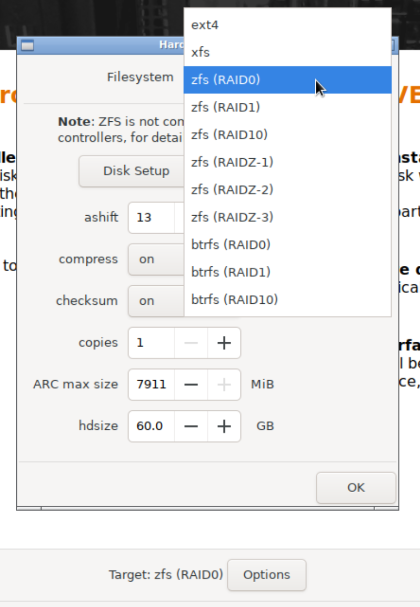

# Homelab
This is a note for uncommon configs, not step-by-step setup guide

## Installation

In disk setup selection step:
- Choose Options next to `Target Harddisk`
- Select disk type as `zfs (RAID0)`
- Tab Disk setup, only select primary SSD for boot, other disks set as `Do not use`
- Set config as above image, ARC max size can be default

## Create partitions
With 1TB drive, we use 60GB for boot disk space, the other will be used as:
- Special device for HDD drives (boost read speed)
- VM Storage

Start with 
```
lsblk                   # List disk partition
fdisk /dev/X            # Replace the disk what to partition
```

Then to this for each partitions
- Press 'n' to create new
- Press 'p' for primary 
- Partition number (default is fine, press Enter)
-  First sector (default is fine, press Enter)
- Last sector: You can specify size like +50G for 50GB or press Enter for full disk

## ZFS Pool Creation
Create 2 pools:
- HDD drives pool for general data
- SSD drives pool for VM, container storage

Add 50GB SSD to `general` pool as special device, 
```
zpool add <yourpool> special /dev/<ssd_partition>
```

### ZFS Pool Config
This is purely to optimize performance, depend on situtation and drives to use. Common command:
```
zfs set <attribute> = <value> <pool>
```
We will set these configs:
```
recordsize=1M
atime=off
xattr=off
compression=zstd-4
special_small_blocks=512K
```

### ZFS Dataset
For some specific data need other configs than ZFS pool but still in that pool we can create dataset
```
zfs create <yourpool>/<dataset_name>
```

## Setup Usable Storage
Navigate to Datacenter -> Storage
- Create Directory for `ISO image, Container template`, mount to ZFS pool/dataset
- Disable `local`, `local-zfs`
- Set ZFS storage for VM, Container as `thin provision`

## Setup CT
Do simple setup except:
- In CPU tab: click Advance -> Setup Cores as unlimited, CPU limit is any value
- Include `nesting=1` and `Unprivileged container=No`

Mount point between Proxmox and CT
- In destinate container, create shared folder with `mkdir /mnt/<folder_name>`
- In proxmox terminal, open destinate config file with `vim /etc/pve/lxc/<ct_id>.conf`
- Edit like this 
  - This will mount `/data/general` in proxmox with `/mnt/general` folder in container
