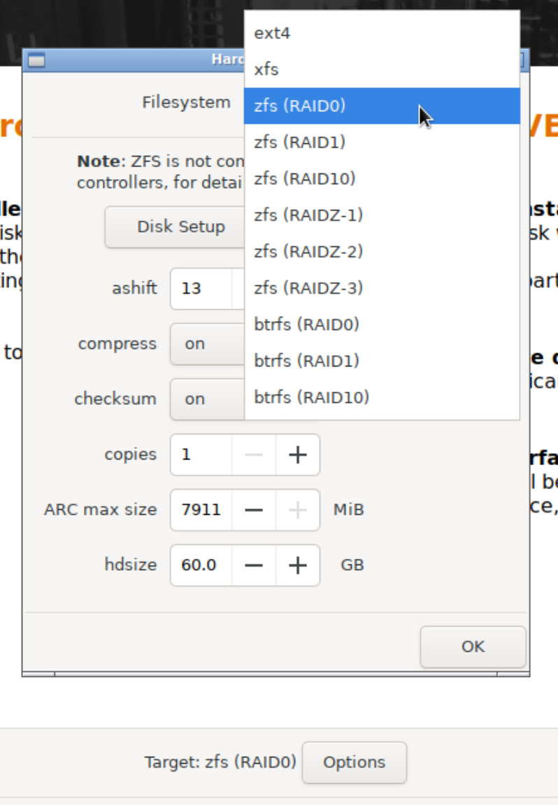
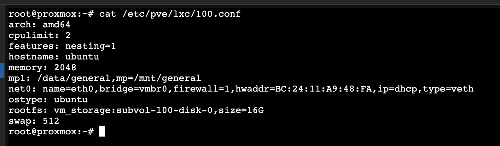

# Proxmox Base Install and Storage Guide

This guide documents the base Proxmox VE install, storage layout, and LXC defaults used by this homelab. It is written as a reproducible checklist with placeholders, not as a live copy of one machine.

Related docs:

- Main rebuild runbook: [`Fresh-Homelab-Rebuild.md`](./Fresh-Homelab-Rebuild.md)
- Canonical CT/IP/mount inventory: [`inventory/lxc-map.md`](./inventory/lxc-map.md)
- Verification checklist: [`VERIFY.md`](./VERIFY.md)

> Secret-safety note: do not paste tokens, passwords, API keys, Cloudflare credentials, or real private notes into this file.

---

## 1. Proxmox installer disk selection

During Proxmox VE installation, use the primary SSD as the boot disk and keep the other disks unused until the system is installed.

At the disk setup screen:

1. Choose **Options** next to `Target Harddisk`.
2. Select filesystem/type:
   - `zfs (RAID0)`
3. In the disk setup tab:
   - Select only the primary SSD for Proxmox boot.
   - Set all other disks to `Do not use`.
4. ARC max size can stay at the Proxmox default unless memory pressure requires tuning later.

Reference screenshot, if present in the repo:



Recommended placeholder convention:

```text
<BOOT_SSD>       primary SSD used by the Proxmox installer, example /dev/nvme0n1
<SSD_POOL_DISK>  SSD/NVMe disk or partition used for fast VM/container storage
<HDD_POOL_DISK>  HDD disk(s) used for general/media data
<SPECIAL_PART>   small SSD partition added as ZFS special vdev for HDD metadata/small blocks
```

---

## 2. Target storage layout

The intended layout is:

| Storage area | Purpose | Typical backing storage |
|---|---|---|
| Proxmox boot/root | Proxmox VE OS | Primary SSD selected during installer |
| `main` pool | VM/container images and Docker/config storage | SSD/NVMe |
| `data` or `general` pool | General data and media | HDD(s), optionally with SSD special vdev |
| Special vdev | Metadata/small block acceleration for HDD pool | SSD partition |

Use names that match the live environment where possible. If rebuilding from scratch, keep pool and dataset names simple and consistent with the mount map in [`inventory/lxc-map.md`](./inventory/lxc-map.md).

Common host paths used later by containers:

| Host path | Purpose |
|---|---|
| `/main/docker` | Docker app/config directories for Docker-based LXCs |
| `/data/media` | Media library/data |
| `/main/backup` | Proxmox Backup Server datastore, if used |
| `/data/general` | General shared dataset; often mounted into CTs as `/mnt/general` |

---

## 3. Inspect disks before partitioning

Run from the Proxmox host shell.

```bash
lsblk -o NAME,SIZE,TYPE,FSTYPE,MOUNTPOINTS,MODEL,SERIAL
```

Confirm which disk is the boot disk before changing partitions:

```bash
zpool status
findmnt /
```

Do **not** partition a disk until it is clearly identified. Replace placeholders before running commands.

---

## 4. Create SSD partition for special vdev or VM storage

If using a 1 TB SSD where part of the disk is reserved for boot and the rest is used for storage, create partitions after install.

Interactive `fdisk` pattern:

```bash
fdisk /dev/<SSD_DISK>
```

Inside `fdisk`:

```text
n          # create new partition
p          # primary partition, if prompted
<enter>    # partition number default is usually fine
<enter>    # first sector default is usually fine
+50G       # example: create a 50 GiB partition for special vdev
w          # write changes after reviewing carefully
```

For another partition using the remaining space:

```text
n
p
<enter>
<enter>
<enter>    # use remaining space
w
```

Refresh partition names:

```bash
partprobe /dev/<SSD_DISK>
lsblk -o NAME,SIZE,TYPE,FSTYPE,MOUNTPOINTS,MODEL
```

Example placeholders after partitioning:

```text
/dev/<SSD_DISK_PART1>  special vdev partition, example 50G
/dev/<SSD_DISK_PART2>  remaining SSD space for VM/container pool, if used
```

---

## 5. Create ZFS pools

Create pools only after disk identity is confirmed.

Example SSD pool for VM/container and Docker/config storage:

```bash
zpool create \
  -o ashift=12 \
  -O compression=zstd-4 \
  -O atime=off \
  -O xattr=off \
  main \
  /dev/disk/by-id/<SSD_OR_PARTITION_ID>
```

Example HDD pool for general/media data:

```bash
zpool create \
  -o ashift=12 \
  -O compression=zstd-4 \
  -O atime=off \
  -O xattr=off \
  data \
  /dev/disk/by-id/<HDD_DISK_ID>
```

If using multiple HDDs, choose the vdev layout intentionally. For simple rebuild docs, keep the command as a placeholder until the exact layout is decided:

```bash
zpool create -o ashift=12 data <mirror|raidz|single-disk-layout> <HDD_BY_ID_PATHS>
```

Check pools:

```bash
zpool status
zfs list
```

---

## 6. Add SSD special vdev to HDD pool

A special vdev can speed up metadata and small-block reads for an HDD pool. Treat it as important pool hardware: if the special vdev fails, the pool can be lost unless it is redundant.

Single special partition pattern:

```bash
zpool add data special /dev/disk/by-id/<SPECIAL_SSD_PARTITION_ID>
```

Redundant special vdev pattern, preferred when possible:

```bash
zpool add data special mirror \
  /dev/disk/by-id/<SPECIAL_SSD_PARTITION_A_ID> \
  /dev/disk/by-id/<SPECIAL_SSD_PARTITION_B_ID>
```

Verify:

```bash
zpool status data
```

---

## 7. Apply ZFS properties

Apply these properties to the relevant pool or dataset. The current homelab baseline is:

```text
recordsize=1M
atime=off
xattr=off
compression=zstd-4
special_small_blocks=512K
```

Copy/paste-safe command pattern:

```bash
zfs set recordsize=1M <pool-or-dataset>
zfs set atime=off <pool-or-dataset>
zfs set xattr=off <pool-or-dataset>
zfs set compression=zstd-4 <pool-or-dataset>
zfs set special_small_blocks=512K <pool-or-dataset>
```

Example for the general data pool:

```bash
zfs set recordsize=1M data
zfs set atime=off data
zfs set xattr=off data
zfs set compression=zstd-4 data
zfs set special_small_blocks=512K data
```

Verify:

```bash
zfs get recordsize,atime,xattr,compression,special_small_blocks <pool-or-dataset>
```

---

## 8. Create datasets

Create datasets for clear mount points and backup boundaries.

Example dataset layout:

```bash
zfs create main/docker
zfs create main/vmdata
zfs create data/media
zfs create data/general
zfs create main/backup
```

If the pool names differ, keep the dataset intent the same and update the inventory map.

Verify mount points:

```bash
zfs list -o name,mountpoint,used,avail
```

Expected examples:

```text
main/docker   /main/docker
data/media    /data/media
data/general  /data/general
main/backup   /main/backup
```

---

## 9. Configure Proxmox storage UI

In the Proxmox web UI:

1. Go to **Datacenter → Storage**.
2. Add directory storage for ISO images and container templates if needed:
   - Content: `ISO image`, `Container template`
   - Path: a dataset-backed path, for example `/main/templates` or another chosen dataset.
3. Disable default storages if they are not used:
   - `local`
   - `local-zfs`
4. Add ZFS storage for VMs and containers:
   - Type: `ZFS`
   - Content: `Disk image`, `Container`
   - Thin provision: enabled where appropriate.
5. Keep naming consistent with the rebuild docs and inventory.

CLI verification:

```bash
pvesm status
```

---

## 10. LXC creation defaults

The canonical LXC defaults live in [`inventory/lxc-map.md`](./inventory/lxc-map.md). Preserve these unless a service guide explicitly says otherwise.

Current defaults:

| Setting | Default |
|---|---|
| Privilege | Privileged container / `Unprivileged container=No` |
| Nesting | Enabled / `nesting=1` |
| CPU | Advanced CPU tab: cores unlimited; CPU limit can be set as desired |
| Storage | Use configured Proxmox ZFS/container storage |

Equivalent config pattern:

```text
features: nesting=1
unprivileged: 0
```

Notes:

- Docker-in-LXC requires nesting enabled.
- This homelab uses privileged LXCs for consistency with the existing setup.
- Keep CPU defaults simple unless a specific service needs a limit.

---

## 11. Bind mount pattern

Create the destination directory inside the container first:

```bash
pct exec <CT_ID> -- mkdir -p /mnt/general
```

Edit the CT config on the Proxmox host:

```bash
nano /etc/pve/lxc/<CT_ID>.conf
```

Add a mount line using this pattern:

```text
mp0: /data/general,mp=/mnt/general
```

This mounts host path `/data/general` into the container at `/mnt/general`.

For Docker/config and media containers, follow the mount map in [`inventory/lxc-map.md`](./inventory/lxc-map.md). Common examples:

```text
mp0: /main/docker,mp=/docker
mp1: /data/media,mp=/media
mp2: /data/general,mp=/mnt/general
```

Restart the container after changing mount config:

```bash
pct restart <CT_ID>
pct exec <CT_ID> -- findmnt /mnt/general
```

Reference screenshot, if present in the repo:



---

## 12. Final verification

Run these checks from the Proxmox host after base setup:

```bash
zpool status
zfs list -o name,mountpoint,used,avail
zfs get recordsize,atime,xattr,compression,special_small_blocks data main
pvesm status
pct list
```

For any container with bind mounts:

```bash
pct config <CT_ID>
pct exec <CT_ID> -- findmnt /mnt/general
```

Documentation follow-up:

- Update [`inventory/lxc-map.md`](./inventory/lxc-map.md) if CT IDs, IPs, ports, or mounts changed.
- Update service guides if a container deviates from the default privileged/nesting/CPU pattern.
