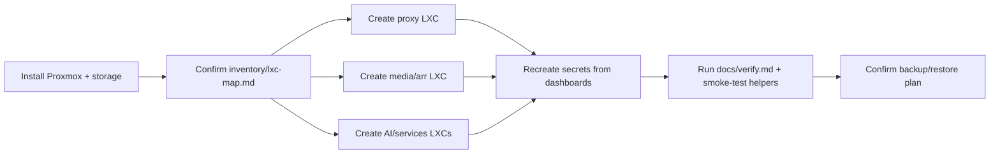

# Homelab Architecture

This diagram is the high-level rebuild map. Use it with:

- [`README.md`](../README.md) for the short documentation index.
- [`docs/rebuild/Fresh-Homelab-Rebuild.md`](./rebuild/Fresh-Homelab-Rebuild.md) for the ordered rebuild runbook.
- [`inventory/lxc-map.md`](../inventory/lxc-map.md) for CT IDs, IPs, ports, mounts, and creation methods.
- [`docs/verify.md`](./verify.md) for post-rebuild checks.

The exact CT IDs, IPs, ports, mounts, and creation methods live in [`inventory/lxc-map.md`](../inventory/lxc-map.md). This file is intentionally secret-free.

## Standard LXC defaults

Most service LXCs should preserve the current homelab defaults unless a service guide says otherwise:

```text
features: nesting=1
unprivileged: 0
```

## High-level service map

```mermaid
flowchart TB
  internet((Internet))
  cf[Cloudflare DNS / Zero Trust]
  users[Users / Devices]

  subgraph pve[Proxmox VE host - 192.168.1.101]
    storage[(Host storage / ZFS datasets)]
    dockerData[(/main/docker)]
    mediaData[(/data/media)]
    backupData[(/main/backup)]
    gpu[/dev/dri GPU devices/]

    subgraph proxy[CT 201 proxy - 192.168.1.201]
      caddy[Caddy reverse proxy]
      tunnel[Cloudflare Tunnel]
      cfmcp[Cloudflare MCP wrapper]
    end

    subgraph media[CT 101 multimedia - 192.168.1.103]
      qb[qBittorrent :8080]
      prowlarr[Prowlarr :9696]
      sonarr[Sonarr :8989]
      radarr[Radarr :7878]
      bazarr[Bazarr :6767]
      tdarr[Tdarr :8265/:8266]
      flaresolverr[FlareSolverr :8191]
      qbproxy[QBWrapper/qbproxy :9911]
      lingarr[Lingarr :9876]
      portainer[Portainer :9443/:8000]
    end

    jellyfin[CT 102 Jellyfin - 192.168.1.104:8096]
    jellyseerr[CT 103 Jellyseerr - 192.168.1.105:5055]
    vaultwarden[CT 104 Vaultwarden - 192.168.1.106]
    n8n[CT 105 n8n - 192.168.1.107:5678]
    redis[CT 106 Redis - 192.168.1.108:6379]
    omniroute[CT 107 OmniRoute - 192.168.1.109:20128]
    hermes[CT 108 Hermes - 192.168.1.110]
    homepage[CT 112 Homepage - 192.168.1.114:3000]
    beszel[CT 113 Beszel - 192.168.1.115]
    proxmoxmcp[CT 114 Proxmox MCP Plus - 192.168.1.116:8000]
    esp32[CT 115 ESP32 Manager - 192.168.1.117:8080]
    openviking[CT 116 OpenViking - 192.168.1.118:1933]
    pbs[CT 250 PBS - 192.168.1.250:8007]
  end

  internet --> cf
  users --> cf
  cf --> tunnel
  cf --> caddy
  tunnel --> caddy

  caddy --> homepage
  caddy --> jellyfin
  caddy --> jellyseerr
  caddy --> vaultwarden
  caddy --> n8n
  caddy --> hermes
  caddy --> omniroute

  dockerData --> media
  mediaData --> media
  mediaData --> jellyfin
  backupData --> pbs
  gpu --> media
  gpu --> jellyfin

  prowlarr --> sonarr
  prowlarr --> radarr
  sonarr --> qb
  radarr --> qb
  qbproxy --> qb
  homepage --> qbproxy
  homepage --> jellyfin
  homepage --> pve
  homepage --> pbs
  jellyseerr --> jellyfin
  jellyseerr --> sonarr
  jellyseerr --> radarr

  hermes -->|OpenAI-compatible API| omniroute
  hermes -->|MCP| proxmoxmcp
  hermes -->|knowledge/memory| openviking
  omniroute --> providers[External/local model providers]
```



## Rebuild flow



## Main network paths

| Flow | Path | Notes |
| --- | --- | --- |
| External HTTPS | Internet -> Cloudflare -> Cloudflare Tunnel/Caddy -> internal service | Keep Cloudflare Access in front of sensitive services. |
| Direct LAN access | LAN device -> LXC IP:port | Use for first setup and troubleshooting. |
| Media requests | Jellyseerr -> Sonarr/Radarr -> qBittorrent -> media folders | Prowlarr syncs indexers to Sonarr/Radarr. |
| Media playback | Jellyfin -> `/media` bind mount -> client | GPU passthrough supports transcoding where configured. |
| Dashboard | Homepage -> Proxmox/PBS/Jellyfin/QBWrapper/services | Tokens live only in Homepage `.env`, not Git. |
| Hermes model calls | Hermes -> OmniRoute `/v1` -> providers | Current pattern uses OmniRoute as the OpenAI-compatible gateway. |
| Hermes MCP calls | Hermes -> Proxmox MCP Plus `/mcp` | Current endpoint is `http://192.168.1.116:8000/mcp`. |
| Hermes knowledge/memory | Hermes -> OpenViking API | Current endpoint is `http://192.168.1.118:1933`. |

## Storage and mount paths

| Host path/device | Consumed by | Purpose |
| --- | --- | --- |
| `/main/docker` | CT 101 media, legacy Docker/helper LXCs, some app LXCs | Docker app config/data. |
| `/data/media` | CT 101 media, CT 102 Jellyfin | Shared media library. |
| `/main/backup` | CT 250 PBS | Backup datastore. |
| `/dev/dri/card0`, `/dev/dri/renderD128` | media/Jellyfin/Tdarr where needed | GPU passthrough/transcoding. |

## Secret boundaries

Do not commit real values for Cloudflare tokens, Caddy DNS challenge credentials, OmniRoute provider keys, Hermes provider keys, Discord allowlists, Proxmox/PBS tokens, or app passwords. Keep real values in live service configs, dashboards, password manager, or encrypted/offline backups only.
